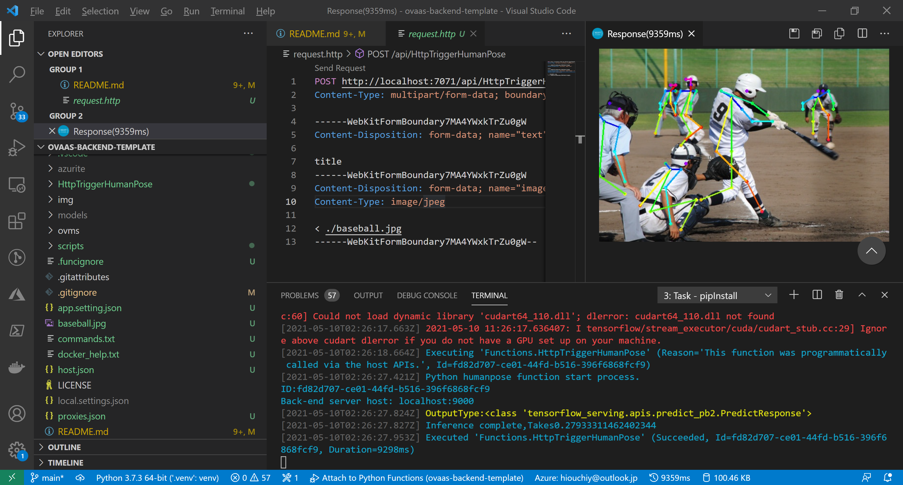

# ovaas-backend-template
This is a template for developing a OVaaS's backend on your local dev machine. Please follow the instrunctions described below and try to have your custom backend application.

## Prerequisites
- Windows 10 / Linux / macOS
- Visual Studio Code
- Docker
- Node.js (npm)
- Azure Storage Explorer
- [Azure Functions Core Tools (v3.x)](https://docs.microsoft.com/ja-jp/azure/azure-functions/functions-run-local?tabs=windows%2Ccsharp%2Cbash#install-the-azure-functions-core-tools)
## Setup Development Environment

### Install softwares described as prerequisites
Recommend to install latest version of each software. All softwares should be installed easily with GUI-based install wizard.
### Install VSCode Extensions
- Launch VSCode
- Go to the Extention pane
- Search and install the extentions below
    - Azure Functions
    - REST Client
### Clone this repository and open it with VSCode
- Launch command prompt and change directory as you want.
- Clone this repository there by the command below
    ```cmd
    git clone https://github.com/OVaaS/ovaas-backend-template.git
    ```
- Launch VSCode to load the repository by the command below
    ```cmd
    cd ovaas-backend-template
    code .
    ```
### Create Python venv on VSCode
VSCode shows a dialog to ask you if venv can be automatically created so it will be easy to create it by clicking "Yes" button there. But you can create it by yourselves using the instructions below if it is not shown.

- Launch command prompt in VSCode
- Create venv by the command below
    This command will create a venv named ".venv" 
    ```cmd
    python -m venv .venv
    ```
After creating the venv, you need to choose a python interpreter to run an application on VSCode.
- Choose Python interpreter

    Open the "Command Palette" from the "View" item on the menu bar and type "Python: Select Interpreter", then you can choose a python interpreter from the list shown there. Recommend to choose the one in the venv you just created.
- Install required libraries
    ```cmd
    python -m pip install --upgrade pip
    pip install -r requirements.txt
    ```

### Launch a local Azure Storage as a Docker container
Now you are ready to launch some docker containers for developping. The first one is a local Azure Storage. Do it following the command below.
- Launch a local Azure storage using the Azurite Docker image

    Windows 10
    ```cmd
    scripts\LaunchAzurite.bat
    ```
    Linux / macOS
    ```bash
    sh scripts/LaunchAzurite.sh
    ```
    After the command executed, check if local Azure storage is launched by Azure Storage Explorer.

### Launch a local OpenVINO Model server with a pre-trained model
- Look at the list of all pre-trained models by the command below.

    Windows 10
    ```cmd
    scripts\GetModelList.bat
    ```
    Linux / macOS
    ```bash
    sh scripts/GetModelList.sh
    ```

- Choose one model to download and download it by the command below. The name "human-pose-estimation-0001" can be changed as you need.
    Windows 10
    ```cmd
    scripts\DownloadModel.bat human-pose-estimation-0001
    ```
    Linux / macOS
    ```bash
    sh scripts/DownloadModel.sh human-pose-estimation-0001
    ```
- Check if the model is downloaded in local folder. For example, above "human-pose-estimation-0001" should be here.
    ```cmd
    PARENT_DIR/ovaas-backend-template/models/intel/human-pose-estimation-0001/FPXX
    ```
- Copy the absolute path to the XML file and the BIN file of the pre-trained model and upload the model to the local Azure Storage by the command below.

    Windows
    ```cmd
    python scripts\UploadModelFilesToAzureStorage.py --model_name human-pose-estimation --xml_file_path PARENT_DIR\ovaas-backend-template\models\intel\human-pose-estimation-0001\FPXX\human-pose-estimation-0001.xml --bin_file_path PARENT_DIR\ovaas-backend-template\models\intel\human-pose-estimation-0001\FPXX\human-pose-estimation-0001.bin
    ```

    Linux / macOS
    ```cmd
    python3 scripts/UploadModelFilesToAzureStorage.py --model_name human-pose-estimation --xml_file_path PARENT_DIR/ovaas-backend-template/models/intel/human-pose-estimation-0001/FPXX/human-pose-estimation-0001.xml --bin_file_path PARENT_DIR/ovaas-backend-template/models/intel/human-pose-estimation-0001/FPXX/human-pose-estimation-0001.bin
    ```
    Here you need four parameters.
    
    - --model_name: The unique model name
    - --xml_file_path: The absolute path to the XML file of the pre-trained model
    - --bin_file_path: The absolute path to the BIN file of the pre-trained model
    - --connection_string: Optional. The connection string to access the local Azure Storage. You can get this on Azure Storage explorer but probably don't need to specify it. You can edit source code if any other connection string is needed.

- Launch a local OpenVINO model server

    Windows 10
    ```cmd
    scripts\LaunchOVMS.bat human-pose-estimation 192.168.10.107
    ```
    Linux / macOS
    ```cmd
    sh scripts/LaunchOVMS.sh human-pose-estimation 192.168.10.107
    ```
    Here you need two parameters.

    - 1st parameter: The unique model name you just named when to upload the model to the local Azure storage.
    - 2nd parameter: The IP address assigned to your PC's ethernet adapter. Note: "localhost" and "127.0.0.1" will not work fine.

### Launch an Azure functions emulater on VSCode
- From the "Run" on the menu bar, click "Start Debugging". Then the emulater should start automatically. You will see the logs like below if it starts successfully.
    ```cmd
    Azure Functions Core Tools
    Core Tools Version:       3.0.3442 Commit hash: 6bfab24b2743f8421475d996402c398d2fe4a9e0  (64-bit)
    Function Runtime Version: 3.0.15417.0


    Functions:

            HttpTriggerHumanPose: [GET,POST] http://localhost:7071/api/HttpTriggerHumanPose

    For detailed output, run func with --verbose flag.
    [2021-05-10T02:00:03.532Z] Worker process started and initialized.
    [2021-05-10T02:00:03.721Z] Host lock lease acquired by instance ID '000000000000000000000000F6FB3AFD'.
    ```
### Run the sample application
- Open the file called "request.http".
- Click the "Send Request" on the top of the pane, then you can see the inference result after a few seconds on the other pane opened like the image below.


## Develop your custom application

### Create a new Azure Function in the project
### Have a new application code following sample code
